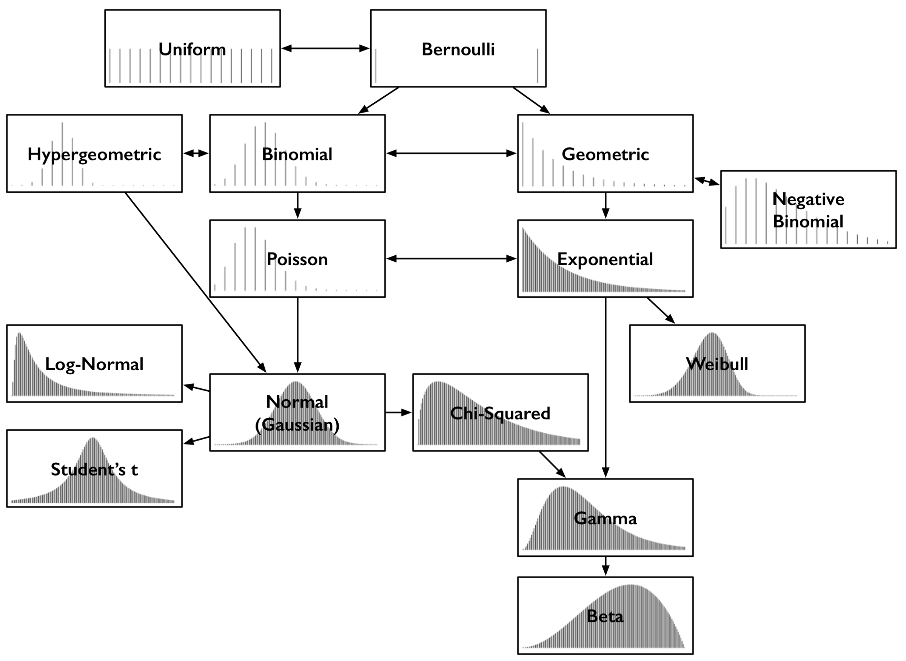

```{r setup, echo=FALSE, include=FALSE}
library(ggplot2)
library(hrbrthemes)
```


```{r echo=FALSE}
comparar.distribuciones <- data.frame(
  tipo = factor(
    rep(paste0("D", 1:5), each = 80),
    levels = c("D1", "D2", "D3", "D4", "D5")
  ), 
  valores = c(
    rnorm(n = 80, mean = 100, sd = 1.5),
    rgamma(n = 80, shape = 100),
    rcauchy(n = 80, location = 100),
    runif(80, min = 90, 110),
    rpois(80, lambda = 100)
  )
)
```

En ocasiones queremos conocer que tipo de distribución tiene unos datos,
mas que considerar si son normales, **¿Que distribución se ajusta?**


Primero es importante tener un panorama de las distribuciones conocidas



## ¿Cuales hay?

Estas son algunas de las distribuciónes existentes, cada una con ocurrencias distintas
y con características propias, algunas son similares como la **Normal** y la
**Student**, otras que no parecen tener nada que ver. 

A simple vista parece fácil definir que distribución puede ajustarse a nuestros datos,
pero ya en la práctica es complicado.

Las características que mas se destacan son dos, la **curtosis** y la **asimetría**.


### Curtosis

Es el grado de concentración que tiene los valores al rededor de la zona central
de la distribución de frecuencias.


```{r echo=FALSE}
set.seed(35)
kurtosis <- data.frame(
  tipo = factor(
    c(rep("Mayor Curtosis", 100), rep("Menor Curtosis", 100)),
    levels = c("Mayor Curtosis", "Menor Curtosis")
  ), 
  position = 51:150,
  valores = c(
    dnorm(x = 51:150, mean = 100, sd = 5),
    dnorm(x = 51:150, mean = 100, sd = 8)
  )
)

ggplot(kurtosis) +
  geom_line(aes(x = position, y = valores, color = tipo, group = tipo), size = 1.5) +
  scale_color_manual(values = c("#DE932B", "#6192A8")) +
  theme_ipsum_rc() +
  labs(
    x = "",
    y = "",
    title = "Curtosis",
    subtitle = "Dos distribuciones normales con diferentes curtosis",
    caption = "Las dos distribuciones tiene la misma media pero distinta dispersión"
  )

```

### Asímetría

La asimetría es la medida que indica que tanto se distribuyen los datos de una variable
respecto a la media aritmética.


- Cuando $\bar{X} < MD$ donde $\bar{X}$ es la media y MD es la mediana se considera 
la distribución con asimetría a la izquiera , asimetría negativa o 
**asimetría de cola izquiera** (puede ser mas intuitivo considerar la _cola_ para
nombrar la distribución).

- Cuando $\bar{X} > MD$ la distribución se considera asimétrica a la derecha, 
con asimetría positiva o **asimetría de cola derecha**.

```{r echo=FALSE}
set.seed(35)
skewness <- data.frame(
  tipo = factor(
    c(rep("Asimétrica Izquiera", 100), rep("Simétrica", 100), rep("Asimétrica Derecha", 100)),
    levels = c("Asimétrica Izquiera", "Simétrica", "Asimétrica Derecha")
  ), 
  position = 51:150,
  valores = c(
    dbeta(x = as.vector(scale(51:150)), shape1 = 2.3, shape2 = 1.4),
    dbeta(x = as.vector(scale(51:150)), shape1 = 2, shape2 = 2),
    dbeta(x = as.vector(scale(51:150)), shape1 = 1.4, shape2 = 2.3)
  )
)

ggplot(skewness) +
  geom_line(aes(x = position, y = valores, color = tipo, group = tipo), size = 1.5) +
  scale_color_manual(values = c("#DE932B", "#89A253", "#6192A8")) +
  coord_cartesian(xlim = c(99, 130)) +
  theme_ipsum_rc() +
  labs(
    x = "",
    y = "",
    title = "Curtosis",
    subtitle = "Dos distribuciones normales con diferentes curtosis",
    caption = "Las dos distribuciones tiene la misma media pero distinta dispersión"
  )
```

## ¿Como lo aplicamos?

El siguiente paso sería usar las características de asimetría y curtosis para 
determinar la distribución de los valores que revisamos. Pero eso implicaría calcular
uno o dos coefientes para determinar la asimetría y uno mas para la kurtosis. 
Para simplificar el proceso podemos usar el paquete `fitdistrplus()` que simplifica la
tarea e incluso aplica técnicas de resampleo para mejorar el pronostico.

Considerando un dataset como este:

```{r}
head(comparar.distribuciones)
```

Con la siguiente estructura:

```{r}
str(comparar.distribuciones)
```

Al graficar las distribuciones vemos:

```{r}
ggplot(comparar.distribuciones) +
  geom_boxplot(aes(x = tipo, y = valores, color = tipo)) +
  theme_ipsum_rc() +
  scale_color_brewer(palette = "Set1") +
  labs(
    title = "Comparativa de las distribuciones",
    subtitle = "Se puede ver que cada distribución tiene un origen distinto",
    y = "Distribuciones"
  )
```

Si revisamos los histogramas:

```{r}
ggplot(comparar.distribuciones) +
  geom_density(aes(x = valores, fill = tipo, color = tipo), alpha = 0.1) +
  theme_ipsum_rc() +
  scale_color_brewer(palette = "Set1") +
  scale_fill_brewer(palette = "Set1") +
  facet_wrap(. ~ tipo, nrow = 2, scales = "free") +
  labs(
    title = "Comparativa de las distribuciones",
    subtitle = "Se puede ver que cada distribución tiene un origen distinto",
    y = "Distribuciones"
  )
```

## Determinemos la distribución D1

### Cargamos la librería

```{r message=FALSE, warning=FALSE}
library(fitdistrplus)
```

### Segmentamos D1

```{r}
distribucion.D1 <- comparar.distribuciones[comparar.distribuciones$tipo == "D1",]
```

Con los valores segmentamos podemos usar la función `descdist()`

```{r}
descdist(distribucion.D1$valores)
```

Los símbolos que se muestran definen algunas de las distribuciones, que este paquete
puede ajustar, ademas tenemos las bandas que muestran áreas que corresponderían
a otras distribuciones. El **punto** de nuestros valores muestra la posición de nuestros
valores derivado de sus características y podemos definir que distribución es la que
mejor se ajusta nuestros valores dependiendo de la proximidad con los símbolos
o su posición en las bandas dibujadas.

En este caso en específico podemos ver que el punto casí se encuentra cercano a
una distribución normal(**asterisco**).

Esta función permite aplicar muchos muestreos sobre nuestros valores y a partir 
de eso mejorar nuestra busqueda.

```{r}
descdist(distribucion.D1$valores, boot = 100)
```

Cada uno de los ensayos generados en cada muestreo se dibuja en amarillo y nos da
una idea de como subconjuntos de los datos se estarían representando en este gráfico.

### Repitamos el ejercicio

```{r}
distribucion.D2 <- comparar.distribuciones[comparar.distribuciones$tipo == "D2",]
descdist(distribucion.D2$valores)
```

En este caso nuestra distribución es difícil de determinar ya que se encuentra
cerca de una distribución normal (línea punteada fina), también cerca de la distribución
gamma (línea punteada gruesa).

### Problemas

Para algunas distribuciones esta aproximación puede fallar, pero aún con esto tenemos información
para buscar la distribución a la que corresponde o simplemente evitar asumir una
la normalidad en una distribución.


```{r}
distribucion.D3 <- comparar.distribuciones[comparar.distribuciones$tipo == "D3",]
descdist(distribucion.D3$valores, boot = 1000)
```
```

